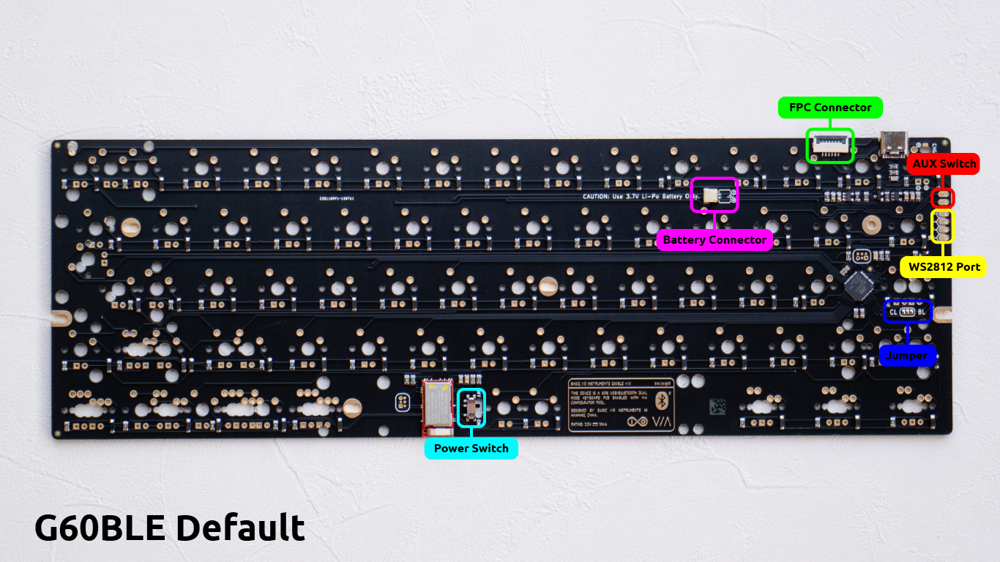
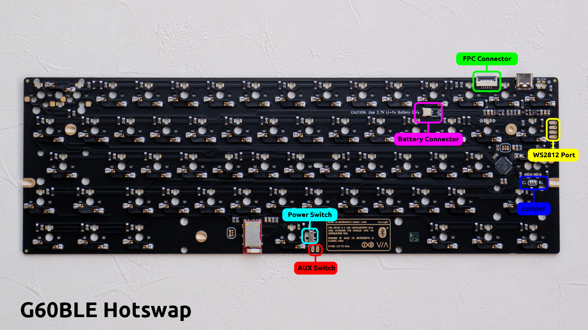
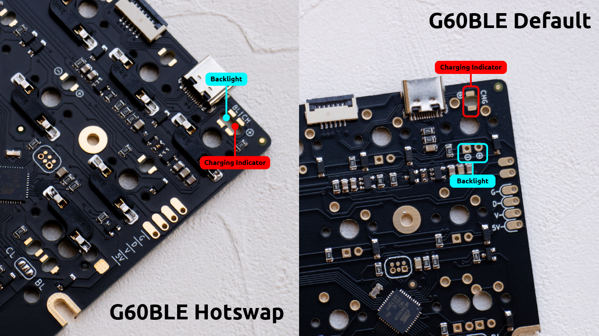
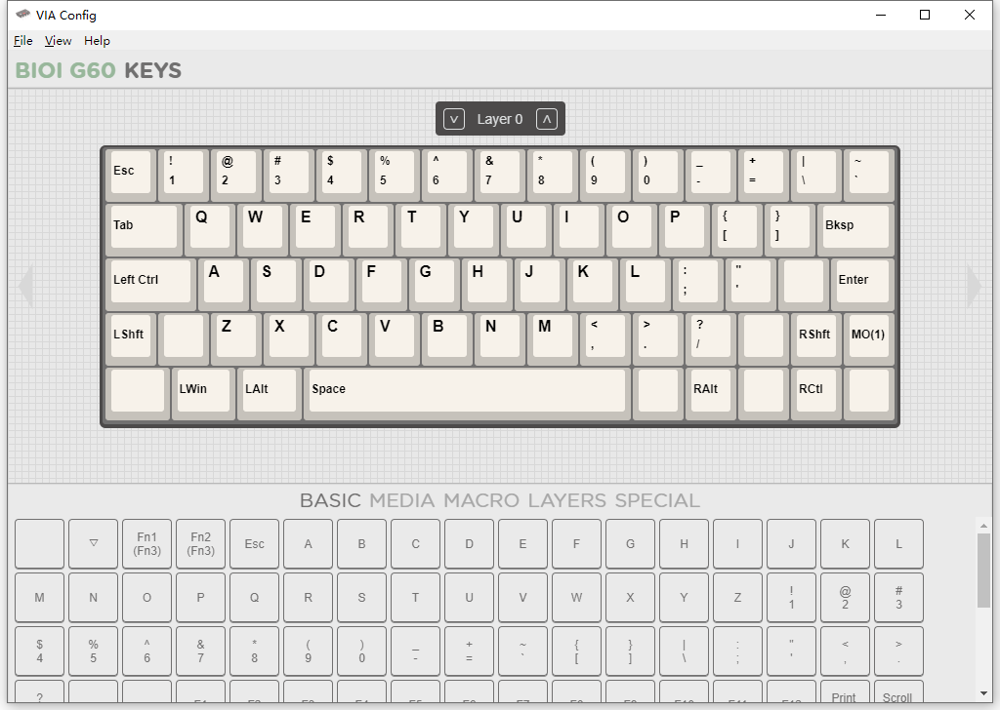

# Basic I/O Instruments G60BLE PCB Guide

## Introduction
Welcome to the G60BLE PCB, this PCB is originally designed for G60 Custom Keyboard, with Bluetooth and USB mode enabled. Powered by QMK and VIA configurator, all the keypress of this board is fully customizable. You can make your own keyboard with any layout that you like.

## Hardware
### Overview
There are two main versions of G60BLE PCB, the "Default" and the "Hotswap", they're slightly different in design. 

For the "Default" version, you need a soldering iron to solder the switches onto the board, and you would want some tricky desoldering skill if you want to remove your switches. This version allows multiple layouts.

For the "Hotswap" version, there is a socket for each switch, allows you to push the switches in or pull it out without any soldering works. But due to the size of the sockets, this version supports only one layout.

- **Power Switch** is the main switch which controls the power from the battery, the two ends of this switch are `SW1` and `SW2`, the `SW1` end comes directly from the positive side of the battery, and the `SW2` is connected to the power circuit. When this switch is on "ON" position, the `SW1` will be connected to the `SW2`, so the power from the battery can go into the board. Or the switch is on "OFF" position, the `SW1` will detach from `SW2`, the power from the battery will be cut off. 
>**NOTICE:** The battery still can be charged even if the power switch is off.

- **FPC Connector** is designed for G60 Custom keyboard only. It's connected to the daughter board by a FPC cable. The sequence of the pins from left to right are:  `SW2|SW1|GND|D-|D+|UVCC`
. So this connector allows a external power switch on the daughter board.

- **AUX Switch** stands for the auxiliary power switch solder pads, the two solder pads are `SW1` and `SW2`,  you can connect them to any external power switch to make it into a power switch for this board. Be aware of the position of this switch on different version of the board.
>**NOTICE:** All the `SW1` and the `SW2` mentioned above are in the same circuit network of the board, this means all the power switches are in parallel, if any one of the switches is ON, the board will be ON, until all the switches are OFF. Do remember to turn off other power switches if you want to use a specific one of them.

- **Battery Connector**, Of course, the battery would go here. It is a JST SH connector. Since most of the battery use a JST PH connector which is a little bigger than SH connector, we provided 2 SH to PH convert cable for each board, each cable has different wire sequence on the PH end. **Do use the right cable to connect the battery, the Red to the positive and the Black to the negative!**

- **WS2812 Port**, You can connect a WS2812 RGB LED strip or 4XRGB kit here, as the silk marks indicated, the pins from top to bottom are:  `GND|DATA|VCC|UVCC`, the `VCC` is 3.3V, which comes from the main power supply of the board, and the "5V" `UVCC` comes directly from the USB cable. So you can connect the VCC of your LED strip to the `UVCC` port on the board to make your RGB strip goes off once the USB cable is pulled out, or to the `VCC` port which will be powered by the battery continually. Or you can power any external addons by this port.

- **Jumper**, Someone might like the LED of the Capslock key acts as the Capslock indicator but some others might like it acts as a normal switch backlight. By this solder jumper, you can select the function of the capsclock LED. As we can see there are 3 solder pads, marked with "CL" to the left and "BL" to the right which stand for "Capslock" and "Backlight", if you like the LED acts as the Capslock indicator, connect the left soder pad to the center one using some soldering tin, or you can connect the right one to the center one to make it acts as a backlight.

### Backlights
For the "Default" version, you can install a 3mm LED for each key switch as a backlight, be aware of the polarity of the solder pads, the Round one is positive and the square one is negative.
For the "Hotswap" version, to prevent the through-hole LEDs from stuck the removable key switches of this version, we used surface-mounted LED instead, the model of the LED would be 1206. Do notice the polarity of the solder pads too, there is a silk mark on the position of the <kbd>Q</kbd>, the one to the left is negative and the one to the right is positive.

### Charging indicator
the Charging indicator is a LED under the <kbd>ESC</kbd>, it will glow when a battery is connected and the USB cable is attached and turns out when the battery is fully charged. We use surface-mounted LED for both the "Default" and the "Hotswap" version of the board, and there is a mark to the positive solder pad. For the "Hotswap" version, the backlight LED for <kbd>ESC</kbd> and the charging indicator are side by side, take a distinguish when you installing one.
>**NOTICE:** Two 1206 surface-mounted Orange LEDs are shipped with the board, you can use them as the Capslock indicator or the charging indicator, or both.

## Firmware
TO BE DONE

## Usage
### USB Mode
Plug in the USB cable and you will start enjoying the board in USB mode.

### Bluetooth Mode
Once the board is powered, it will start boardcasting as "BIOI G60BLE". To pair the board to your computer, you just need to search for "BIOI G60BLE" then add it to your system in the Bluetooth settings. To unpair the board, just remove it from the paired devices.
The Bluetooth interface of this board only working when your board is paired and no USB cable is connected, once the USB cable is connected, it will preferentially use the USB interface. But in the future, I will introduce a function to force the board working in Bluetooth mode.

### Bootloader(DFU) Mode
Once you want to upgrade the firmware or reset the EEPROM of the board, you will need to bring the board into bootloader or DFU mode first, and you will do it like this:
1. Turn off the power switch (all the power switches);
2. Pull out the USB cable (if it is attached);
3. Plug the USB cable in agian while keep pressing the <kbd>ESC</kbd>, until you see the yellow text "Device Connected" on the QMK Toolbox Console.

### Lock Mode
In this mode, the board will ignore any key pressing, like it has been locked. this mode is very useful when you're difficult to access the power switch and you want to put the board into your backpack. To enable Lock Mode, you just need to press <kbd>LShift</kbd>+<kbd>RShift</kbd>+<kbd>L</kbd> at the same time, do it again the board will quit Lock Mode.

### VIA Configurator

The G60BLE use this beautiful and easy-to-use tool to configure the keystroke. Thank you for your great work, Oliva.

You can get this tool here:

<https://caniusevia.com/>

and an interesting demo video by MechMerlin:

<https://www.youtube.com/watch?v=sAUO7_Ts4Pw/>

The G60BLE is officially supported by the VIA, and you will use the VIA only in the USB mode. The layout displayed in VIA exposed all the possible layouts of G60BLE, you can ignore those keys doesn't belong to your current layout. The screenshot above shows the keys used by an HHKB layout.

### Factory Reset
If there is something wrong with the keymap of your keyboard, or the Bluetooth mode doesn't work, or you're upgrading your firmware to the latest from an older one, It's highly recommended performing a factory reset operation to your keyboard. Please follow the following instrutions:
1. Open the QMK Toolbox, bring your keyboard into Bootloader(DFU) Mode, Click "Clear EEPROM" or "Reset EEPROM" button on the QMK Toolbox interface, ignore the warning or question text on the console.
2. Flash the "eeprom_reset.hex" into your keyboard with the "Flash" button, you can get this HEX file on https://github.com/scottywei/bioi-g60ble/releases or in the "qmk_firmware/quantum/tools/" directory of the master QMK firmware release.
3. Bring the keyboard into Bootloader(DFU) mode again, then flash the latest firmware, leave the keyboard still for 3 to 5 seconds after the firmware is uploaded.
4. Search for Bluetooth devices from your Operation System, checking if there is a device named "BIOI G60BLE", if there is, means you have successfully reset your keyboard. if not, please refer to step 5.
5. Program any key to <kbd>F21</kbd> by the VIA configurator, then minimize or close the VIA window, press the <kbd>F21</kbd> key, then back to step 4 to check the Bluetooth Devices, you might need to repeat this operation for serval times. Remember to program that key back to your commonly used one.