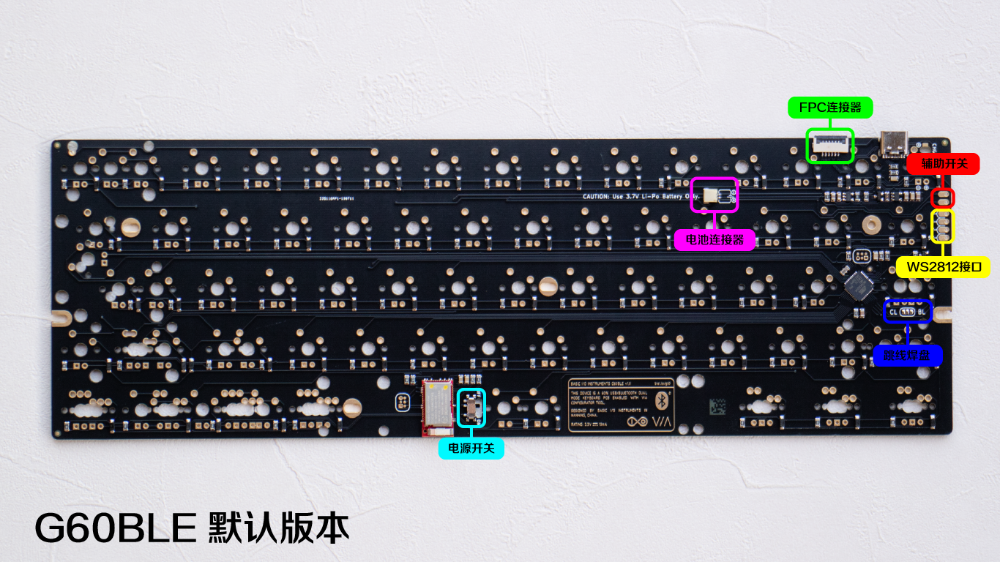
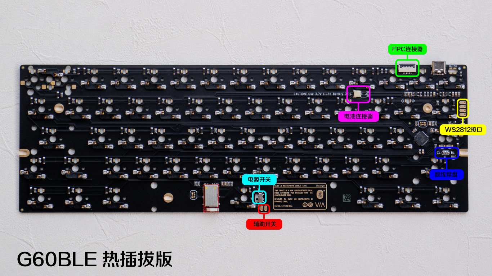
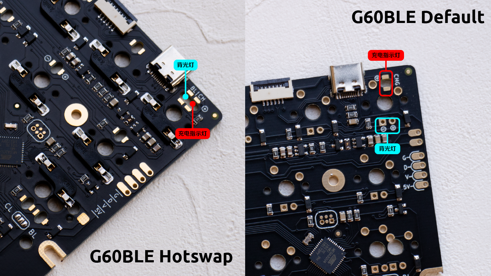
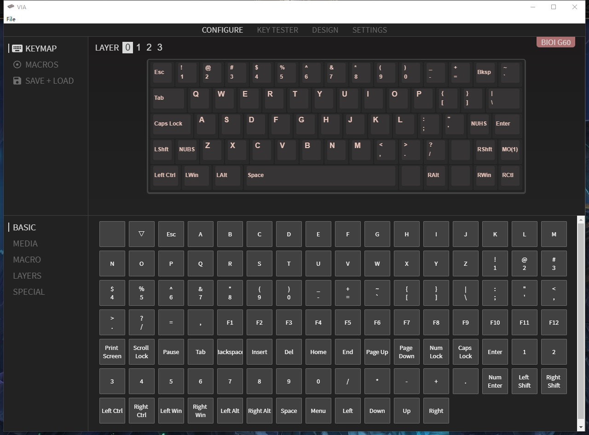

# Basic I/O Instruments G60BLE PCB 手册

## 简介
欢迎使用G60BLE PCB，这是一张针对G60客制化键盘套件设计的60%双模PCB。使用QMK固件和VIA键位设置软件，可以对所有键位进行自定义设置，以此实现不同的键盘配列布局。

## 硬件
### 概览
G60BLE PCB分为“默认”和“热插拔”两个版本，这两个版本在设计上略有不同。

“默认”版，也就是焊接版，需要你将键盘轴体焊接到PCB上使用，你需要掌握电烙铁的使用技巧。这个版本支持多种配列。

“热插拔”版，为每个轴位配备了热插拔底座，你可以把轴体直接插到PCB上就可以使用了。但由于热插拔底座的尺寸比较大，这个版本无法做到多种布局的兼容，只支持一个布局（在大小写锁定键和退格键处可以做一些调整）。

- **电源开关** 是控制电池输出的主开关，开关的两端连接到`SW1`和`SW2`，其中`SW1`连接到电池的正极，`SW2`则连到负载电路的输入端。当开关拨到“ON”的位置时，`SW1`与`SW2`连接，电池与负载电路相连，反之，当拨到“OFF”位置时，电池与负载电路断开。

>**注意：** 即便当开关拨到“OFF”位置时，我们仍然可以对电池进行充电。

- **FPC连接器** 是专门为G60客制化套件设置的，用于连接到G60套件的一个USB延长版。这个连接器从左到右的线序分别为：`SW2|SW1|GND|D-|D+|UVCC`。USB延长版上带有一个开关。

- **辅助开关**是两个焊盘，分别连接到`SW1`和`SW2`，你可以将任何一个开关装置的两端连接到这两个焊盘，把它变成这个电路板的开关。注意，两个不同版本的PCB辅助开关位置是略有区别的。

>**注意：** 上文提到的所有的`SW1`和`SW2`在电路图上都分别是同一个点，也就是说，电路板上连接到这两个点的开关都是并联的，其中任何一个开关拨到“ON”的位置的时候，电池就会连接，而要断开电池连接，所有的开关必须都要在“OFF”的位置。如果你经常使用某特特定的开关，请确保其他开关都在“OFF”位。

- **电池连接器** 顾名思义，电池连接器自然是连接电池的，和大多数电池使用的JST PH连接器不同。G60BLE PCB上的连接器使用的是JST SH插头，这个插头比PH插头更薄，可以避免需要在PCB底部为电池插头留出额外的空间。提高对各种壳子的兼容性。G60BLE PCB会配上两根PH到SH插头的转接线，两根转接线在PH端有着不同的正负极线序，这样只要选购PH插头的3.7v锂电池就好了，正负极的顺序无所谓了。**注意，安装的时候一定要留意正负极顺序，红色时正极，黑色是负极!**

- **WS2812接口**，用来连接WS2812 RGB灯带或者4灯小板。从上到下的焊盘顺序依次为：`GND|DATA|VCC|UVCC`，其中`VCC`是来自电路板线性稳压器的3.3v电源，`UVCC`是直接来自USB接口的5v电源。由于WS2812(或者是4灯小板上的SK6812)是耗电大户，你可以把灯带或者4灯的电源接到`UVCC`上，这样就可以使用USB为你的RGB供电，而拔掉USB之后RGB不会消耗电池的电量。当然，这里也可以为其他任何的外部组件供电。

- **跳线焊盘**，对于大小写锁定键位置上的LED，有些玩家可能想把它作为大小写指示灯，而也许其他玩家则希望它作为一个普通的背光灯，这些都可以通过这个跳线焊盘来实现。跳线焊盘由三个焊盘组成，在左右两边分别有“CL”和“BL”字样。如果你希望实现的是大小写指示灯的功能，那么就用焊锡把CL一侧的焊盘与中间的焊盘相连，反之如果你希望实现的是背光功能，那么就把BL一侧的焊盘与中间焊盘相连。

### 背光灯
对于默认版，每个轴位都预留了直插式LED的焊盘，你可以安装3mm直径的LED灯珠或者234方形LED直插灯珠。注意LED的极性，圆形焊盘是正极，方形焊盘是负极。

对于热插拔版，为了确保轴体的取出不受直插式LED的影响，这个版本使用的式贴片式1206LED，正贴式跟反贴式的都行，留意发光方向就好了。在按键 <kbd>Q</kbd> 处给出了正负极标记示例，请务必看清楚正负极方向。

### 充电指示灯
充电指示灯位于 <kbd>ESC</kbd> 下方，当电池接入并且正在充电时，充电指示灯就会亮起，电池充满时指示灯就会熄灭。默认版和热插拔版的充电指示灯都是使用1206贴片式LED。留意焊盘边的正负极标记。热插拔版的ESC背光灯与充电指示灯是并排的，请留意区分。

>**注意：** G60BLE PCB随机配送了两颗1206贴片式LED灯，你可以酌情把它们用在充电指示灯或大小写指示灯处。

## 固件
你可以从<https://github.com/scottywei/bioi-g60ble/releases>下载最新的固件。

## 使用

### USB模式
插入USB线缆，键盘即会优先在USB模式下工作。

### 蓝牙模式
只要键盘的电路板在上电状态，板子上的蓝牙模块就会开始广播一个名为“BIOI G60BLE”的设备。你只需要使用你的设备搜索并配对该设备，即可在该设备上使用键盘。当不想在该设备上使用键盘时，直接删除已配对的BIOI G60BLE即可。
蓝牙模式只会在蓝牙已经配对并且USB线缆没有插入的情况下启动，一旦你插入USB线缆，键盘将优先使用USB模式。未来计划将提供一个固件更新，以实现强制在蓝牙模式下工作的功能。

### Bootloader(DFU)模式

当你需要升级固件，重置主控的EEPROM等操作的时候，你需要将电路板调入Bootloader模式，请按照以下步骤进行操作：

1. 将所有开关拨到OFF位置；
2. 拔掉USB线缆；
3. 按住 <kbd>ESC</kbd> 不放的同时插入USB线缆，当QMK Toolbox的控制台上出现黄色的`Device Connected`字样时表示键盘已进入DFU模式。

### 锁定模式

在锁定模式下，键盘会忽略任何按键动作。这个模式非常适用于你想把键盘放入背包但又不容易操作电源开关的情况。要进入锁定模式，需要同时按住 <kbd>LShift</kbd>+<kbd>RShift</kbd>+<kbd>L</kbd> 键，再按一次上述组合即可退出锁定模式。

### VIA配置器

G60BLE使用这款简约的配置软件来配置按键功能，感谢Olivia和Wilba为我们带来的便捷。

VIA官网下载地址：<https://caniusevia.com/>

G60BLE是VIA官方支持的PCB，只需打开VIA软件，将USB线缆插入键盘，VIA软件即可识别出G60BLE键盘，VIA只能在USB模式下识别出键盘并设置键位。VIA界面上的G60BLE键位与常见的键盘不一样，这是为了展示G60BLE所支持的所有可能的键位，你可以忽略那些与你当前键位布局无关的按键。

### 恢复出厂状态

当你的键盘出现键位异常，蓝牙模式无法工作，或是需要升级固件时，强烈建议先进行一次恢复出厂状态操作。请参考以下步骤：

1. 打开QMK Toolbox软件，将键盘切换到Bootloader(DFU)模式，点击QMK Toolbox界面上的"Clear EEPROM"或"Reset EEPROM"按钮，你可以忽略软件控制台返回的一些警告提示。
2. 然后打开"eeprom_reset.hex"文件，并点击"Flash"按钮将其刷到键盘里，"eeprom_reset.hex"文件可以从<https://github.com/scottywei/bioi-g60ble/releases>下载，或者直接在QMK主分支的`qmk_firmware/quantum/tools/`目录下找到。
3. 向键盘刷入最新的固件文件，并且在成功后等待至少3至5秒。
4. 使用你的设备搜索是否存在一个名为"BIOI G60BLE"的蓝牙设备，如果存在，证明你已经成功重置键盘到出厂状态，如果没有，请参考第5步。
5. 使用VIA将某个按键修改为 <kbd>F21</kbd> 键，然后最小化或关闭VIA窗口，按下你刚编好的 <kbd>F21</kbd> 键，然后回到第4步，搜索蓝牙设备，如果没有找到，可以再次按下 <kbd>F21</kbd> 键，直至你能搜索到正确的蓝牙设备。记得在成功后把这个 <kbd>F21</kbd> 改回你平时使用的键。